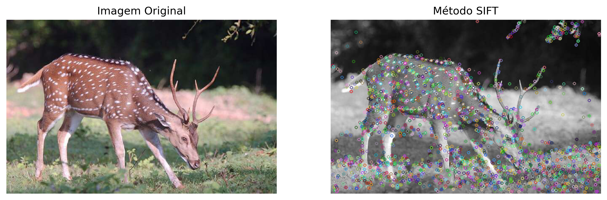
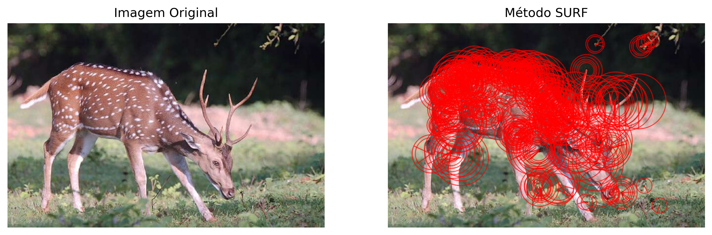
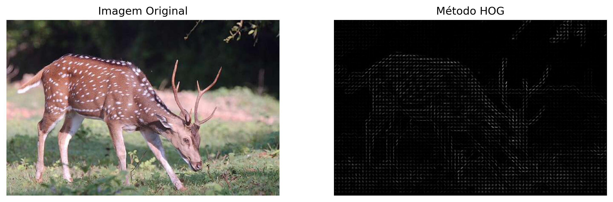

# 
EXTRATOR DE CARACTERÍSTICAS

## 🌱 1. INTRODUÇÃO

A visão computacional é uma área de pesquisa que busca conferir às máquinas a capacidade de "ver" e interpretar o mundo visual à sua volta de maneira semelhante à visão humana. Dentro deste campo, os extratores de características desempenham um papel crucial, permitindo que algoritmos identifiquem e utilizem pontos de interesse específicos dentro de imagens para realizar tarefas como reconhecimento de objetos, navegação espacial, e correspondência de imagens. Três dos mais influentes desses extratores são o Scale-Invariant Feature Transform (SIFT), o Speeded Up Robust Features (SURF), e o Histogram of Oriented Gradients (HOG). Cada um desses métodos oferece uma abordagem única para a detecção e descrição de características locais em imagens, equilibrando precisão, eficiência computacional e robustez sob diversas condições de imagem, como variações de escala, rotação e iluminação.

O SIFT, introduzido por David Lowe em 2004, é pioneiro na identificação de características invariantes à escala e rotação, proporcionando uma base sólida para a correspondência de imagens em aplicações que exigem alta precisão. O SURF, por sua vez, surgiu como uma alternativa ao SIFT, buscando reduzir a complexidade computacional e acelerar o processo de extração sem comprometer significativamente a robustez das características detectadas. O HOG foi desenvolvido como uma técnica eficiente para a análise e identificação de formas e estruturas em imagens, sendo amplamente utilizado em aplicações de detecção de objetos, como na identificação de pedestres. A principal força do HOG está na sua capacidade de capturar informações de borda e gradiente que são fundamentais para a aparência e forma dos objetos nas imagens.

Este documento visa explorar em detalhe os fundamentos, as vantagens e as limitações desses três métodos de extração de características, oferecendo insights sobre como eles podem ser aplicados efetivamente em diversos contextos de visão computacional. Através da análise comparativa e de estudos de caso, buscamos entender melhor como o SIFT, o SURF e o HOG podem ser utilizados para melhorar o desempenho de sistemas de visão computacional em tarefas complexas de reconhecimento e correspondência de imagens.

## 🔍 2. Introdução ao Scale-Invariant Feature Transform (SIFT)

O Scale-Invariant Feature Transform (SIFT) é um algoritmo de extrema importância para a Visão Computacional, que permite a detecção e descrição de características locais em imagens. Desenvolvido por David Lowe, o SIFT é amplamente utilizado devido à sua robustez e eficiência, sendo capaz de identificar e isolar características distintas que são invariantes a mudanças de escala e rotação, além de serem resistentes a alterações na iluminação.

### 2.1 A Robustez do SIFT

A capacidade do SIFT em identificar keypoints que são consistentes e confiáveis sob diversas condições é o que o torna tão valioso para tarefas de reconhecimento e correspondência de imagens. A técnica utiliza a Diferença de Gaussianas para identificar potenciais pontos de interesse através das escalas da imagem, refinando-os para precisão através da expansão em série de Taylor e rejeitando pontos de baixo contraste ou aqueles que são muito sensíveis a variações de perspectiva.

### 2.2 O Processo de Extração de Características

O SIFT não só identifica keypoints, mas também cria descritores detalhados baseados em histogramas de gradientes orientados em torno de cada ponto. Este processo envolve a divisão da vizinhança de um keypoint em sub-blocos e a acumulação de informações sobre direções de gradientes em histogramas. Esses descritores são o que tornam o SIFT tão poderoso na correspondência de imagens, mesmo quando há variações significativas entre elas.

## 🌊 3. Speeded-Up Robust Features (SURF)

O SURF (Speeded-Up Robust Features) representa um avanço significativo no campo da Visão Computacional, sendo introduzido em 2006 como uma alternativa mais rápida e eficiente ao tradicional SIFT (Scale-Invariant Feature Transform). Desenvolvido por Herbert Bay e outros, o SURF acelera o processo de detecção e descrição de características locais em imagens, mantendo uma robustez comparável ao SIFT em relação a variações de escala e rotação, e também oferece resistência a mudanças na iluminação.

## ✬ 4. Método HOG

O Histogram of Oriented Gradients (HOG) é um método de extração de características que se concentra na contagem da ocorrência de direções de gradientes em porções localizadas de uma imagem. Desenvolvido inicialmente para a detecção de pedestres dentro do campo da visão computacional, o HOG provou ser extremamente eficaz na caracterização de formas e estruturas locais de objetos em imagens, tornando-se um componente essencial em uma variedade de aplicações de reconhecimento de objetos.

### 4.1 Princípios do HOG

A ideia fundamental por trás do HOG é que a aparência e a forma de um objeto dentro de uma imagem podem ser descritas pela distribuição de direções de gradientes de intensidade, ou bordas. O processo começa pelo cálculo do gradiente de intensidade em cada pixel da imagem, seguido pela compilação desses gradientes em histogramas orientados dentro de células locais que cobrem a imagem. Estes histogramas são então normalizados em blocos maiores para melhorar a invariância a mudanças de iluminação e contraste.

### 4.2 Aplicações do HOG

Além de sua aplicação seminal na detecção de pedestres, o HOG tem sido utilizado em uma ampla gama de tarefas de visão computacional, incluindo reconhecimento de faces, detecção de veículos e classificação de objetos. Sua capacidade de capturar informações detalhadas sobre a estrutura local sem necessidade de conhecimento prévio sobre a forma ou tamanho dos objetos o torna particularmente útil para tarefas de reconhecimento em ambientes complexos.

### 4.3 Vantagens e Limitações

Uma das principais vantagens do HOG é sua robustez em capturar informações essenciais de forma e borda, mesmo em condições de baixo contraste ou iluminação variável. No entanto, como muitos métodos baseados em gradientes, ele pode ser sensível a posturas extremas ou variações de objeto, e sua eficácia pode diminuir em cenas com alta densidade de objetos ou sobreposição.

## 🏁 Conclusão

A análise comparativa dos métodos SIFT, SURF e HOG para a extração de características em imagens revela insights valiosos sobre a visão computacional e a detecção de objetos. Cada um desses métodos aborda o problema de uma maneira única, capitalizando em diferentes aspectos das imagens.

O SIFT, com sua robustez em identificar e descrever keypoints invariantes, é excepcional para tarefas onde a correspondência precisa entre diferentes vistas de um objeto é necessária. Isso é evidenciado pela rica distribuição de pontos de interesse localizados ao longo dos contornos e texturas distintas do objeto, como mostrado na imagem com o Método SIFT.

O SURF, por outro lado, oferece uma abordagem mais rápida, embora menos detalhada que o SIFT. Ele é particularmente útil em aplicações onde a velocidade é crucial e uma correspondência exata não é estritamente necessária. O Método SURF destaca áreas de maior interesse com círculos que representam a localização e a escala dos pontos-chave.

Quanto ao HOG, ele se destaca na captura da forma e da estrutura dos objetos em uma imagem. É evidente na representação visual HOG que as bordas e contornos do objeto são capturados de forma eficaz, destacando a estrutura global do objeto em questão sem focar em pontos individuais.

Esses métodos são complementares e a escolha entre eles depende das exigências específicas da aplicação em questão. O SIFT e o SURF são mais adequados para reconhecimento e correspondência de imagens, enquanto o HOG é frequentemente a escolha para análise e detecção de formas de objetos.
